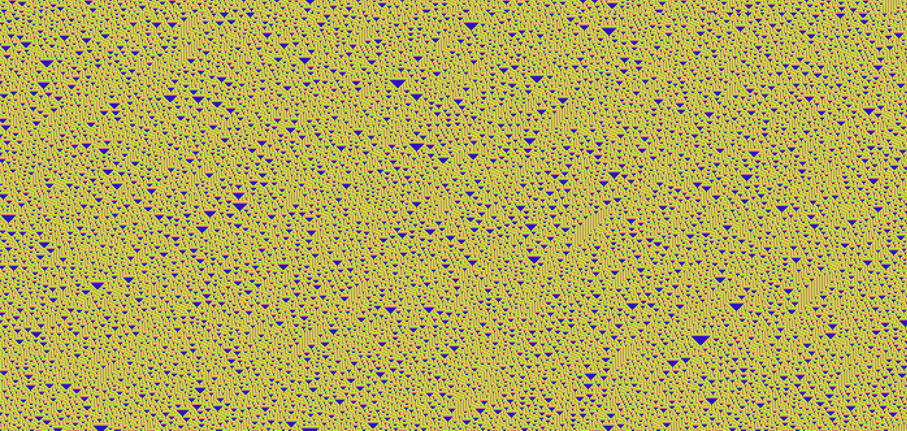

# Elementary Cellular Automaton

A javascript implementation of [Elementary cellular automaton](https://en.wikipedia.org/wiki/Elementary_cellular_automaton). 
It uses [p5.js](https://p5js.org/) for the game objects and the game rendering.

# How to run
You can run this game by opening the [index.html](./index.html) in your browser or you can run a simple http server in the root folder of this repo e.g. (in python) `python -m http.server`
